# Sơ đồ hệ thống TravelConnect

Tài liệu này tổng hợp các sơ đồ nghiệp vụ và dữ liệu cốt lõi của hệ thống `TravelConnect`, dựa trên các chức năng đang có trong mã nguồn: xác thực tài khoản, khám phá bài viết, booking, thanh toán, quản lý dịch vụ khu du lịch, thông báo, bạn bè, nhắn tin và quản trị hệ thống.

## 1. Sơ đồ Use Case

```mermaid
flowchart LR
    KD[Khách du lịch]
    DT[Đối tác khu du lịch]
    QT[Quản trị viên]

    UC1((Đăng ký tài khoản))
    UC2((Đăng nhập))
    UC3((Quên mật khẩu / OTP))
    UC4((Xem và cập nhật hồ sơ))
    UC5((Đăng bài chia sẻ))
    UC6((Khám phá bài viết))
    UC7((Lưu, thích, bình luận, đánh giá))
    UC8((Đặt vé / booking))
    UC9((Thanh toán ví))
    UC10((Xem booking của tôi))
    UC11((Kết bạn và nhắn tin))
    UC12((Quản lý hồ sơ khu du lịch))
    UC13((Quản lý gói dịch vụ))
    UC14((Quản lý booking và quét QR))
    UC15((Xem thống kê kinh doanh))
    UC16((Quản lý người dùng))
    UC17((Quản lý trạng thái hồ sơ khu du lịch))
    UC18((Quản lý danh mục và cấu hình nền tảng))
    UC19((Giám sát bài viết, thanh toán, booking))

    KD --> UC1
    KD --> UC2
    KD --> UC3
    KD --> UC4
    KD --> UC5
    KD --> UC6
    KD --> UC7
    KD --> UC8
    KD --> UC9
    KD --> UC10
    KD --> UC11

    DT --> UC1
    DT --> UC2
    DT --> UC3
    DT --> UC4
    DT --> UC5
    DT --> UC6
    DT --> UC12
    DT --> UC13
    DT --> UC14
    DT --> UC15
    DT --> UC11

    QT --> UC2
    QT --> UC16
    QT --> UC17
    QT --> UC18
    QT --> UC19
```

## 2. Sơ đồ luồng dữ liệu DFD

### 2.1. DFD mức ngữ cảnh

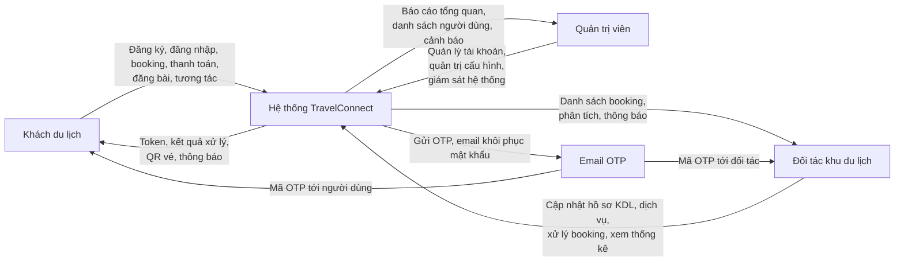

### 2.2. DFD mức 1

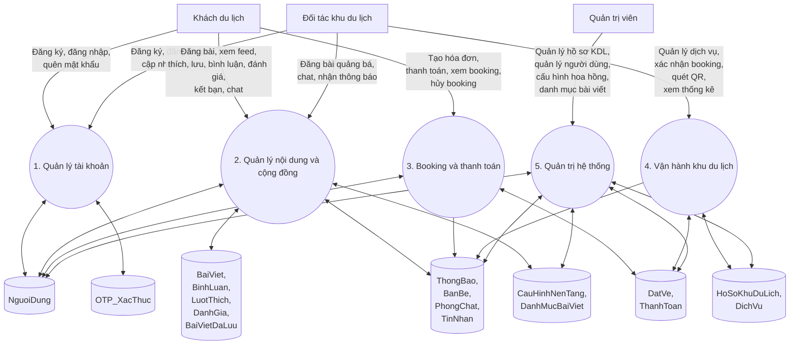

## 3. Sơ đồ ERD

```mermaid
erDiagram
    NGUOI_DUNG ||--o| HO_SO_KHU_DU_LICH : so_huu
    NGUOI_DUNG ||--o{ BAI_VIET : dang
    NGUOI_DUNG ||--o{ DAT_VE : dat_ve_voi_tu_cach_khach
    NGUOI_DUNG ||--o{ DAT_VE : nhan_booking_voi_tu_cach_kdl
    NGUOI_DUNG ||--o{ THANH_TOAN : thanh_toan
    NGUOI_DUNG ||--o{ THONG_BAO : nhan_thong_bao
    NGUOI_DUNG ||--o{ THONG_BAO : gui_thong_bao
    NGUOI_DUNG ||--o{ BINH_LUAN : viet
    NGUOI_DUNG ||--o{ LUOT_THICH : thich
    NGUOI_DUNG ||--o{ BAI_VIET_DA_LUU : luu
    NGUOI_DUNG ||--o{ DANH_GIA_KDL : danh_gia
    NGUOI_DUNG ||--o{ BAN_BE : gui_loi_moi
    NGUOI_DUNG ||--o{ BAN_BE : nhan_loi_moi
    NGUOI_DUNG ||--o{ OTP_XAC_THUC : nhan_otp
    NGUOI_DUNG ||--o{ THANH_VIEN_PHONG_CHAT : tham_gia
    NGUOI_DUNG ||--o{ TIN_NHAN : gui_tin_nhan

    HO_SO_KHU_DU_LICH ||--o{ DICH_VU : cung_cap
    HO_SO_KHU_DU_LICH ||--o{ DANH_GIA_KDL : duoc_danh_gia

    BAI_VIET ||--o{ BINH_LUAN : co
    BAI_VIET ||--o{ LUOT_THICH : co
    BAI_VIET ||--o{ BAI_VIET_DA_LUU : duoc_luu
    BAI_VIET ||--o{ DANH_GIA_KDL : nhan_danh_gia

    PHONG_CHAT ||--o{ THANH_VIEN_PHONG_CHAT : gom
    PHONG_CHAT ||--o{ TIN_NHAN : chua

    NGUOI_DUNG {
        int id PK
        string ten
        string email
        string mat_khau
        enum vai_tro
        decimal so_du
        int diem_tin_cay
        string anh_dai_dien
        enum trang_thai_tai_khoan
        json so_thich_json
        boolean da_xac_thuc_otp
        datetime ngay_tao
    }

    HO_SO_KHU_DU_LICH {
        int id PK
        int id_nguoi_dung FK
        string ten_khu_du_lich
        string tinh_thanh
        string dia_chi_chi_tiet
        text mo_ta_tong_quan
        enum trang_thai_duyet
        text ghi_chu_duyet
        datetime ngay_duyet
    }

    BAI_VIET {
        int id PK
        int id_nguoi_dung FK
        string tieu_de
        text noi_dung
        json media_json
        json hinh_anh_json
        int id_kdl_gan_the
        string ten_kdl_gan_the
        string danh_muc
        json kiem_duyet_so_json
        datetime ngay_tao
    }

    DICH_VU {
        int id PK
        int id_khu_du_lich FK
        string ten_dich_vu
        decimal gia_tien
        text mo_ta
    }

    DAT_VE {
        int id PK
        int id_kdl FK
        int id_khach FK
        date ngay_den
        int so_ngay
        int so_nguoi
        string loai_ve
        string ten_khach
        decimal tong_tien
        string ma_ve
        text ma_qr
        enum trang_thai
        text ghi_chu
        datetime thoi_gian_quet_ve
        datetime ngay_tao
    }

    THANH_TOAN {
        int id PK
        int id_nguoi_dung FK
        int id_kdl FK
        string ten_kdl
        decimal tong_tien
        int id_nguoi_gioi_thieu
        date ngay_den
        int so_luong
        enum trang_thai
        string phuong_thuc
        string ma_tra_cuu
        datetime ngay_tao
    }

    THONG_BAO {
        int id PK
        int id_nguoi_nhan FK
        int id_nguoi_gui FK
        text noi_dung
        string loai_thong_bao
        int id_lien_ket
        boolean da_xem
        datetime ngay_tao
    }

    BINH_LUAN {
        int id PK
        int id_nguoi_dung FK
        int id_bai_viet FK
        text noi_dung
        datetime ngay_tao
    }

    LUOT_THICH {
        int id PK
        int id_nguoi_dung FK
        int id_bai_viet FK
        datetime ngay_tao
    }

    BAI_VIET_DA_LUU {
        int id PK
        int id_nguoi_dung FK
        int id_bai_viet FK
        datetime ngay_luu
    }

    DANH_GIA_KDL {
        int id PK
        int id_kdl FK
        int id_bai_viet FK
        int id_nguoi_dung FK
        int so_sao
        text noi_dung
        datetime ngay_tao
    }

    BAN_BE {
        int id PK
        int id_nguoi_gui FK
        int id_nguoi_nhan FK
        enum trang_thai
        datetime ngay_tao
    }

    OTP_XAC_THUC {
        int id PK
        string email
        string ma_otp
        string loai
        datetime het_han
        boolean da_su_dung
    }

    PHONG_CHAT {
        int id PK
        string ten_nhom_chat
        enum loai_phong
        datetime ngay_tao
    }

    THANH_VIEN_PHONG_CHAT {
        int id PK
        int id_phong FK
        int id_nguoi_dung FK
    }

    TIN_NHAN {
        int id PK
        int id_phong FK
        int id_nguoi_gui FK
        text noi_dung
        enum loai_tin_nhan
        datetime thoi_gian_gui
    }
```

## 4. Sơ đồ User Flow

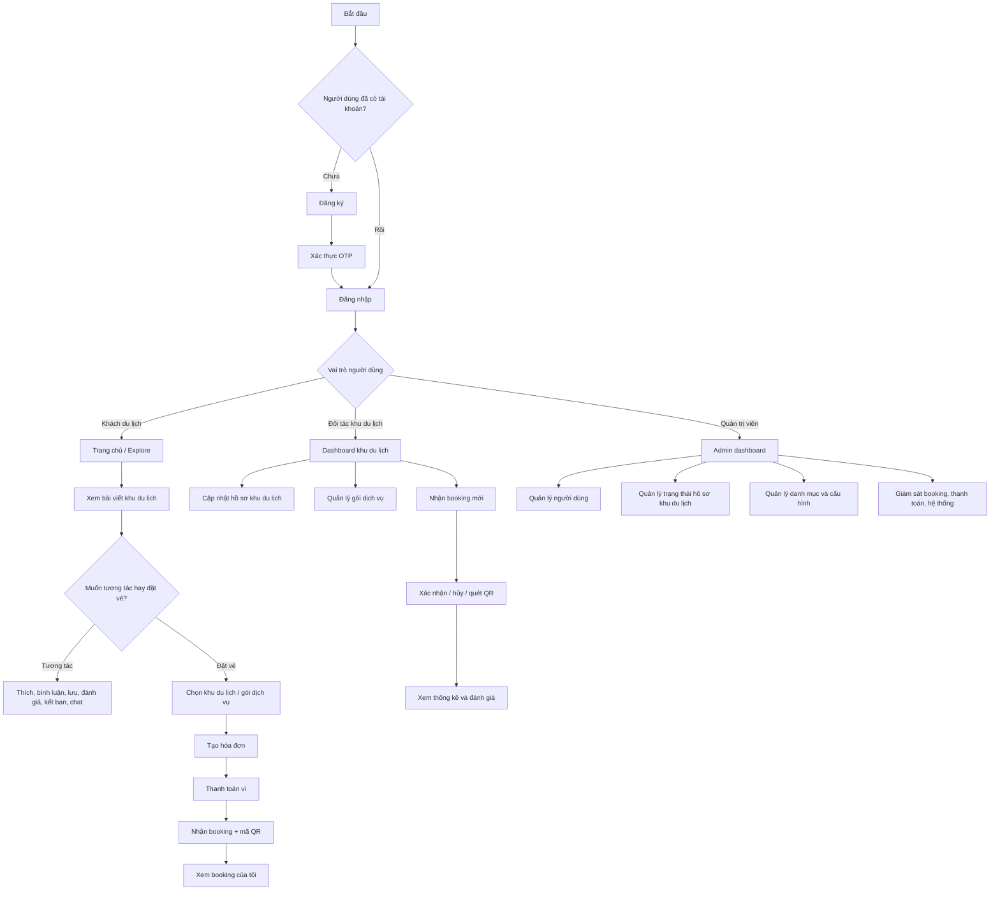

## 5. Sơ đồ luồng hoạt động hệ thống

Phần này mô tả chi tiết các luồng hoạt động chính của hệ thống `TravelConnect`, từ lúc người dùng đăng ký tài khoản cho đến khi hoàn tất booking, quản lý dịch vụ và giám sát hệ thống.

### 5.1. Luồng đăng ký, xác thực OTP và đăng nhập

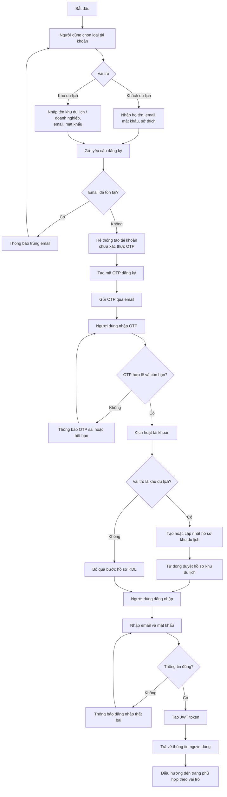

### 5.2. Luồng khám phá, đăng bài và tương tác nội dung

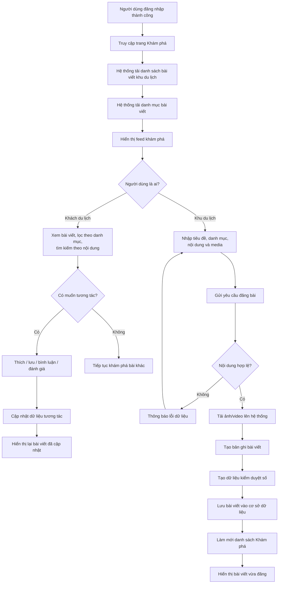

### 5.3. Luồng đặt vé, thanh toán và check-in QR

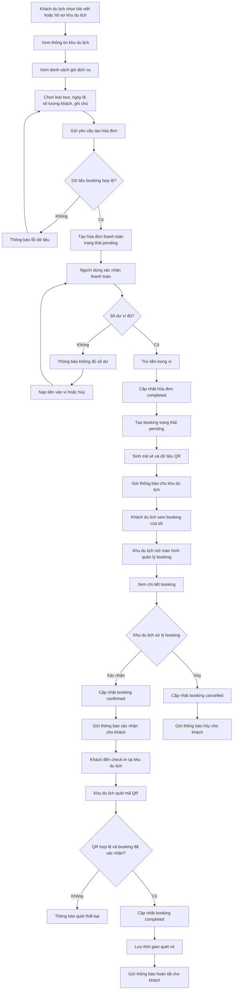

### 5.4. Luồng quản lý hồ sơ và dịch vụ khu du lịch

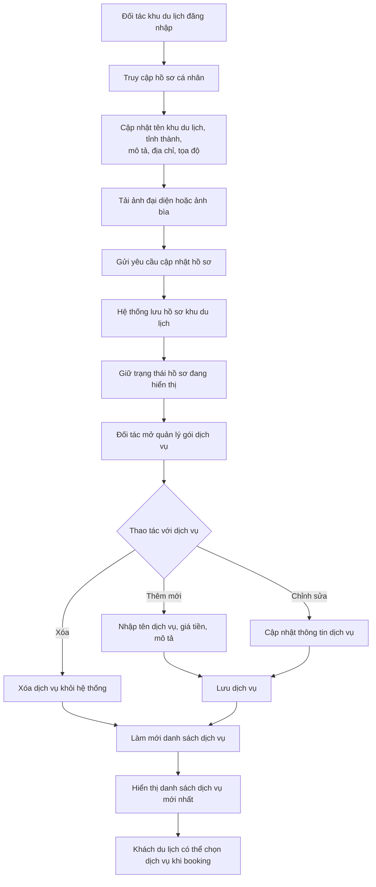

### 5.5. Luồng quản trị và giám sát hệ thống

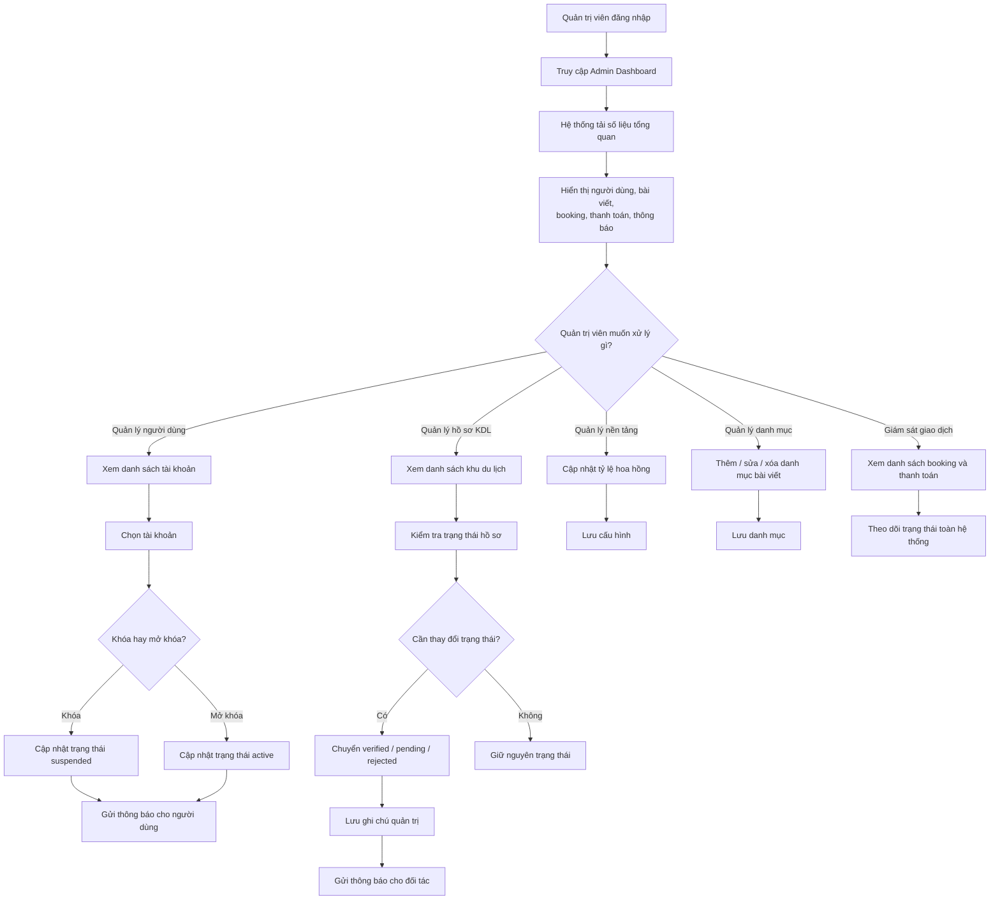

### 5.6. Luồng quên mật khẩu

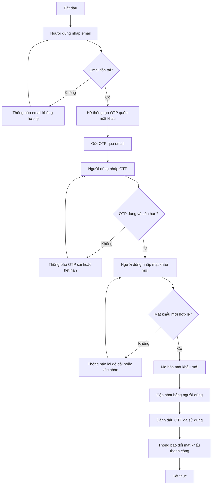

## 6. Mô tả ngắn các thành phần chính

- `Khách du lịch`: đăng ký, đăng nhập, khám phá nội dung, tương tác xã hội, đặt vé, thanh toán, theo dõi booking.
- `Đối tác khu du lịch`: quản lý hồ sơ khu du lịch, dịch vụ, booking, check-in QR, xem thống kê và đánh giá.
- `Quản trị viên`: giám sát hệ thống, quản lý người dùng, quản lý trạng thái hồ sơ KDL, quản lý danh mục và cấu hình nền tảng.
- `Kho dữ liệu cốt lõi`: `nguoi_dung`, `ho_so_khu_du_lich`, `bai_viet`, `dich_vu`, `dat_ve`, `thanh_toan`, `thong_bao`.
