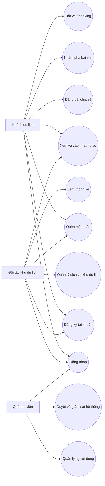
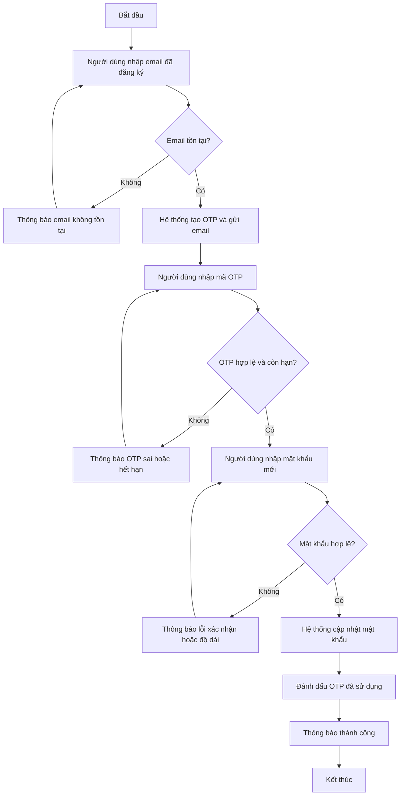
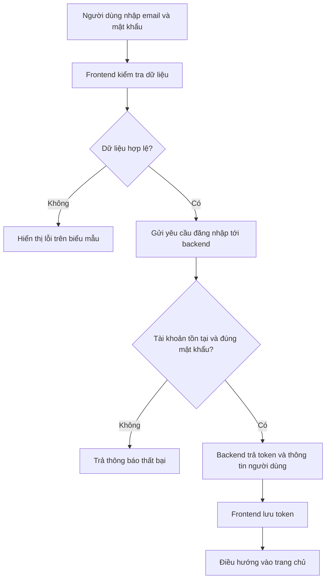

# Sơ đồ nghiệp vụ TravelConnect

Tài liệu này mô tả ngắn các tác nhân chính và luồng hoạt động trọng tâm của hệ thống.

## 1. Sơ đồ Use Case

## 2. Sơ đồ luồng hoạt động quên mật khẩu

## 3. Mô tả ngắn luồng đăng nhập

## 4. Tác nhân chính

- `Khách du lịch`: đăng ký, đăng nhập, khám phá bài viết, đặt vé, quản lý hồ sơ.
- `Đối tác khu du lịch`: quản lý hồ sơ khu du lịch, dịch vụ, booking và thống kê.
- `Quản trị viên`: giám sát hệ thống, quản lý người dùng và xử lý các vấn đề vận hành.
